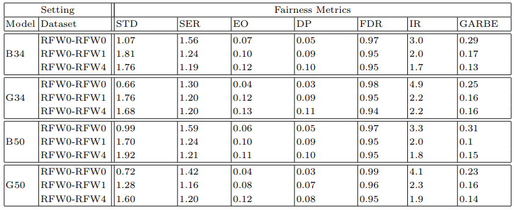
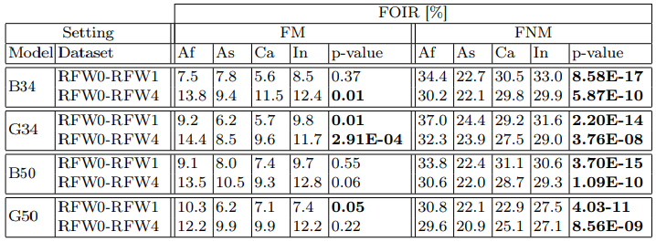

# Fairness Under Cover: Evaluating the Impact of Occlusions on Demographic Bias in Facial Recognition

This repository contains the code and approximate data replication for the paper, _Fairness Under Cover: Evaluating the Impact of Occlusions on Demographic Bias in Facial Recognition_. The study investigates how occlusions affect demographic fairness in face recognition models, with a specific focus on ethnic biases. Using synthetic occlusions, we analyze face verification models’ performance and fairness, introducing metrics to measure the impact of occlusions across demographic groups.


### Key Contributions
- Demonstrates unequal performance decreases across ethnicities when occlusions are present.
- Proposes the **Face Occlusion Impact Ratio (FOIR)**, a metric quantifying the effect of occlusions on model predictions across demographics.
- Provides synthetic occlusion protocols used in experiments, enabling an approximate dataset replication (version 2.0).

## Dataset

Due to compression loss, the exact dataset from the study cannot be fully replicated. For reproducibility, this repository includes an approximate version 2.0 of the occluded dataset, featuring the synthetically occlusions used on the RFW dataset. 

The occlusions can be downloaded here: https://mega.nz/folder/jQ0XxJQT#OrIRtTrqziDqN69yl4bclQ (Occlusions)


## Repository Structure

- models/: Folder to add the used model weights, downloadable here: https://mega.nz/folder/jQ0XxJQT#OrIRtTrqziDqN69yl4bclQ (models)
- recreate_occluded/: Code to recreate occluded dataset either centered (recreate_occluded_centered.sh) or uncentered (recreate_occluded.sh).
- src/: Main code of the project (order of execution of .sh files extract_accuracies_and_fairness.sh -> extract_xSSAB.sh -> extract_overlaps.sh) 
- results/: Store results of src execution.
- environment.yml: Enviornment configuration.


## Notes for Execution

Extract Occlusions.zip and models.zip (https://mega.nz/folder/jQ0XxJQT#OrIRtTrqziDqN69yl4bclQ) in this workspace.


## Results on V2 Dataset






## Citation

Cite this as:

> ```
> @inproceedings{mamede2024fairness,
>   title={Fairness Under Cover: Evaluating the Impact of Occlusions on Demographic Bias in Facial Recognition},
>   author={Mamede, Rafael M. and Neto, Pedro C. and Sequeira, Ana F.},
>   booktitle={Proceedings of the International Conference on Pattern Recognition},
>   year={2024}
> }
> ```